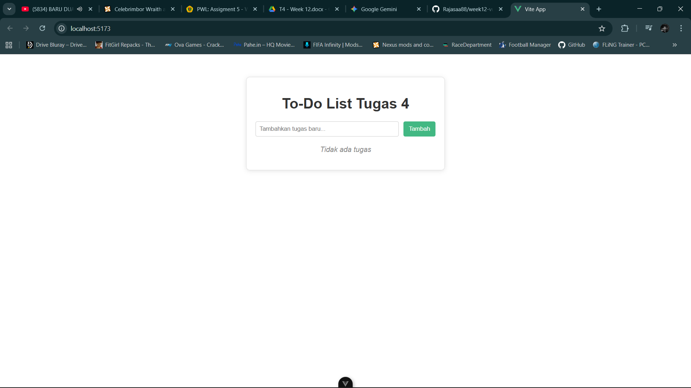
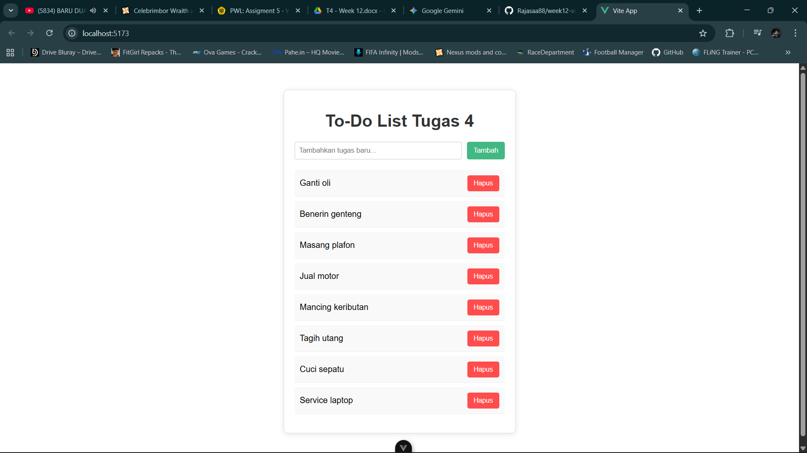
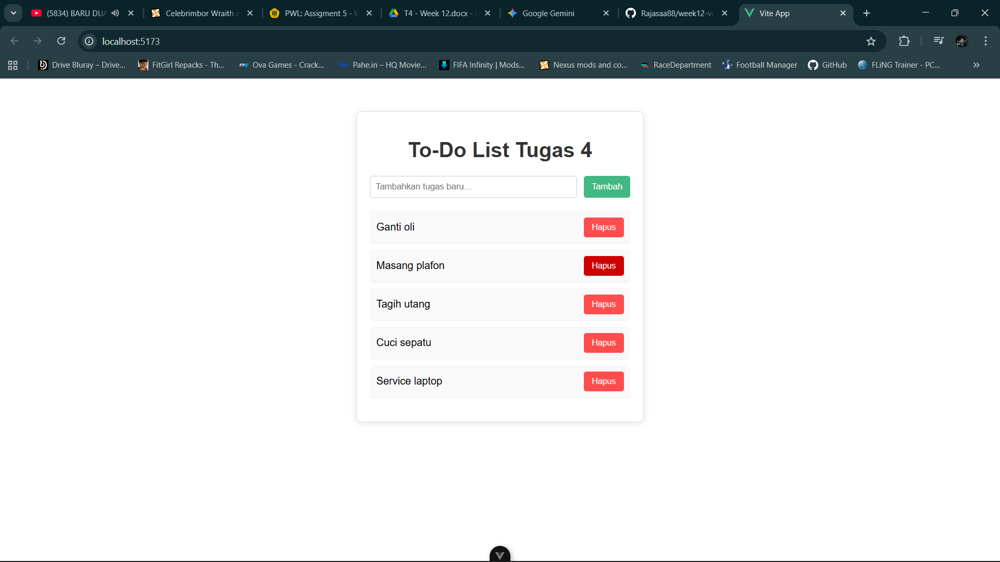
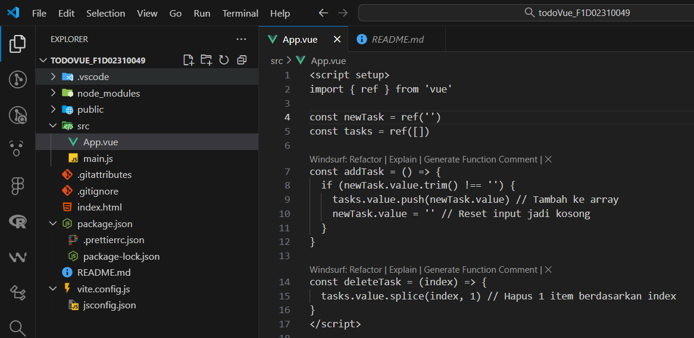

# Assignment: Vue.js – Simple To-Do List

## Identitas

- Nama : Fakhrurrizal Adhirajasa
- NIM : F1D02310049

---

## Deskripsi Tugas

Pada tugas ini saya membuat aplikasi To-Do List sederhana menggunakan Vue.js.
Aplikasi memiliki fitur:

- Menambah tugas
- Menghapus tugas
- Menampilkan pesan saat daftar kosong
- Menggunakan reaktifitas dengan `ref()`

---

## Hasil

### 1. Screenshot Hasil Program

**Tampilan Awal (Kosong):**

**Tampilan Saat Terisi:**

**Fitur Hapus:**

**Kode Program (App.vue):**

### 2. Penjelasan Singkat

**Bagaimana `addTask()` bekerja:**
Fungsi ini mengambil nilai dari variabel reaktif `newTask`. Jika input tidak kosong, nilai tersebut dimasukkan ke dalam array `tasks` menggunakan method `.push()`. Setelah itu, input `newTask` dikosongkan kembali agar siap untuk input berikutnya.

**Bagaimana data ditampilkan menggunakan `v-for`:**
Saya menggunakan directive `v-for="(task, index) in tasks"` pada elemen `<li>`. Ini akan melakukan perulangan sebanyak jumlah data di dalam array `tasks` dan merender elemen list untuk setiap tugas.

**Cara kerja tombol hapus:**
Tombol hapus memanggil fungsi `deleteTask(index)`. Fungsi ini menerima parameter index dari item yang diklik, lalu menggunakan method JavaScript `.splice(index, 1)` untuk menghapus 1 elemen dari array `tasks` pada posisi index tersebut.
